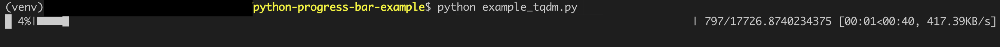

# python-progress-bar-example

This an example of using the tqdm library to adde preogress bar to command
line applications using python

As this is example is intended to download a file from internet using `requests`
library and usign `tqdm` as passthrough to show a progress bar in command line, 
we use the followin two libraries
* tqdm
* requests

Example:

